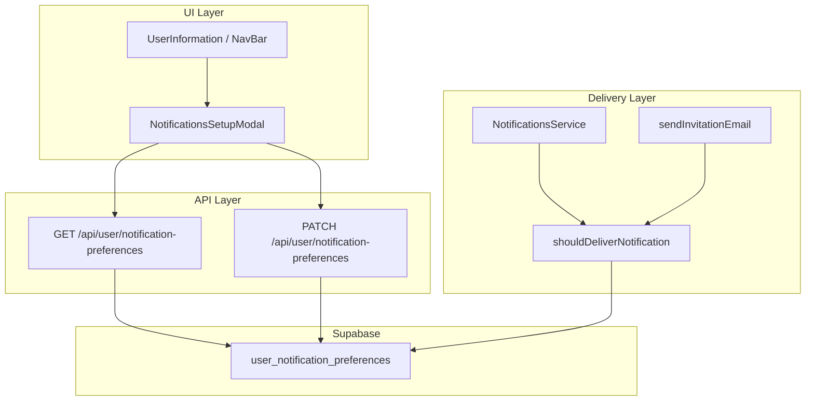
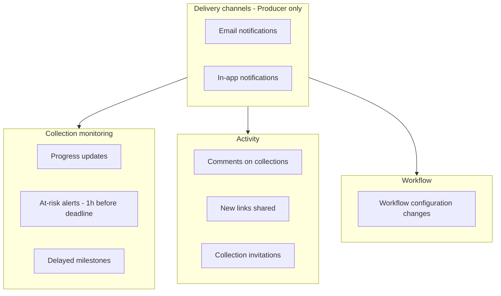

# Plan: Notifications Setup

## Contexto actual

Hoy **no existe almacenamiento de preferencias por usuario**. El sistema de notificaciones es template-driven:

- [`notification_templates`](supabase/migrations/016_notifications_system.sql) define triggers, destinatarios (`email_recipients` / `inapp_recipients`) y canales.
- [`NotificationsService`](lib/services/notifications/notifications.service.ts) resuelve destinatarios vía [`recipient-resolver.ts`](lib/services/notifications/recipient-resolver.ts) (`producer` → miembros con rol `noba`; entidades → `client`, `photo_lab`, `photographer`, etc.).
- **Comentarios** no usan templates: `handleCommentAdded()` envía email + in-app directamente.
- **Invitaciones** de colección usan [`lib/invitations.ts`](lib/invitations.ts) + [`sendInvitationEmail`](lib/email/send-invitation.ts), fuera de la tabla `notifications`.

El entry point UI existe en [`user-information.tsx`](components/custom/user-information.tsx) (desktop) y [`nav-bar.tsx`](components/custom/nav-bar.tsx) (mobile), cableado desde los 4 templates (`main-template`, `collection-template`, `creation-template`, `view-template`).

---

## Arquitectura propuesta



**Principio clave:** las preferencias se modelan por **categorías de negocio**, no por cada uno de los ~35 template codes. Un mapa central traduce template/evento → categoría, y el servicio consulta preferencias antes de `createNotification()`.

---

## Clusterización de notificaciones

### Categorías canónicas (backend)

| Categoría (`preference_key`) | Qué cubre | Templates / eventos |
|---|---|---|
| `collection_progress` | Hitos completados, avances de workflow | `scanning_completed`, `photographer_selection_uploaded`, `dropoff_upcoming`, `dropoff_confirmed_status`, `client_selection_confirmed`, `highres_ready`, `edition_request_ready`, `final_edits_completed`, `photographer_edits_approved`, `shooting_completed_confirmed_to_photographer`, `client_confirmation_reminder` |
| `collection_at_risk` | Alertas ~1h antes del deadline | `*_risk`, `*_at_risk`, `*_urgent_reminder`, `edition_completion_check`, `photographer_review_reminder`, `client_selection_morning_reminder`, `shooting_pickup_reminder`, `dropoff_confirmation_reminder` |
| `collection_delayed` | Retrasos (`*_deadline_missed`) | `dropoff_delayed`, `scanning_delayed`, `photographer_selection_delayed`, `client_selection_delayed`, `highres_delayed`, `edition_request_delayed`, `final_edits_delayed`, `photographer_review_delayed` |
| `collection_comments` | Comentarios en steps | `handleCommentAdded()` + evento `comment_added` |
| `collection_links` | Nuevos links compartidos | `lab_shared_additional_materials`, `photographer_shared_additional_materials`, `client_shared_additional_materials`, `retouch_studio_shared_additional_materials`, `photographer_last_check_shared_additional_materials` |
| `collection_invitations` | Invitaciones a colección / plataforma | `createInvitationsForPublishedCollection`, `sendInvitationEmail` (team invite) |
| `collection_workflow_changes` | Reconfiguración de workflow | `workflow_reconfiguration_announcement` (in-app only hoy) |

Nuevo archivo: [`lib/services/notifications/notification-preference-mapping.ts`](lib/services/notifications/notification-preference-mapping.ts) con el mapa `templateCode → category` y helpers para comentarios/invitaciones.

---

### Vista Producer (`profiles.is_internal = TRUE`)

Usuarios noba/producer reciben la mayoría de alertas de **monitoreo** (delayed, at-risk cross-step). UI con **control dual email / in-app** por categoría:



**Secciones del modal (Producer):**

1. **Delivery channels** — toggles maestros opcionales (si email master OFF, todas las categorías email quedan deshabilitadas visualmente).
2. **Collection monitoring**
   - Progress updates — hitos completados en cualquier step
   - At-risk alerts — deadline a 1h (todos los `*_risk` donde producer es recipient)
   - Delayed milestones — `*_delayed` (exclusivo producer en la práctica)
3. **Activity**
   - Comments — email + in-app
   - New links shared — email + in-app
   - Collection invitations — **solo email** (no hay in-app hoy; toggle in-app disabled/hidden)
4. **Workflow**
   - Workflow changes — **solo in-app** (template actual: `emailRecipients: []`)

**Notificaciones producer relevantes hoy** (según [`notification-templates.ts`](lib/services/notifications/notification-templates.ts)):
- Email-only: `shooting_pickup_reminder`, `shooting_pickup_reminder_digital`
- Email + in-app: todos los `*_delayed`, varios at-risk/progress
- In-app-only: `dropoff_confirmed_status`

El filtro de preferencias debe respetar qué canales existen realmente por template (no crear in-app si el template no lo soporta).

---

### Vista Entity (`profiles.is_internal = FALSE`)

Versión **light** reutilizando las mismas categorías backend, pero:

- **Sin cluster `collection_delayed`** en UI (casi ningún template delayed va a entidades; solo producer recibe retrasos globales).
- **Sin toggles duplicados email/in-app por categoría en v1** — un solo switch por categoría que aplica a ambos canales (más simple). Alternativa: mismos toggles duales pero ocultando categorías irrelevantes.
- Labels contextualizados según `entity.type` del usuario (`client`, `photo-lab`, `self-photographer`, etc.).

**Secciones del modal (Entity):**

1. **Your deadlines** → mapea a `collection_at_risk`
   - Ej. client: "Client selection deadline reminders"
   - Ej. photo_lab: "Scanning / drop-off deadline reminders"
   - Ej. photographer: "Selection and review deadline reminders"
2. **Collection updates** → mapea a `collection_progress`
   - Hitos donde su rol es recipient (ej. client recibe `photographer_selection_uploaded`; lab recibe `dropoff_upcoming`)
3. **Activity**
   - Comments → `collection_comments`
   - New links shared → `collection_links`
4. **Other** (opcional en v1)
   - Collection invitations → `collection_invitations`
   - Workflow changes → `collection_workflow_changes` (in-app)

**Matriz entity por rol** (qué categorías mostrar):

| Rol (`player.type`) | At-risk | Progress | Comments | Links |
|---|---|---|---|---|
| `client` | client selection reminders | selection uploaded, edits approved | steps client | client selection links |
| `photo_lab` | scanning/dropoff | dropoff upcoming | low-res step | — |
| `self_photographer` / `photography_agency` | selection/review reminders | scanning completed, highres ready, edits | photographer steps | photographer steps |
| `handprint_lab` | highres at-risk | client selection confirmed | high-res step | — |
| `retouch_studio` | final edits at-risk | edition request ready | final edits step | retouch links |

La visibilidad se resuelve en frontend con [`determineEntityType()`](lib/services/supabase-profile-service.ts) + config estática; el backend filtra siempre por categoría (seguro aunque el usuario cambie de rol en otra colección).

---

## Modelo de datos (Supabase)

Nueva migración `090_user_notification_preferences.sql`:

```sql
CREATE TYPE notification_preference_category AS ENUM (
  'collection_progress',
  'collection_at_risk',
  'collection_delayed',
  'collection_comments',
  'collection_links',
  'collection_invitations',
  'collection_workflow_changes'
);

CREATE TABLE public.user_notification_preferences (
  id            UUID PRIMARY KEY DEFAULT gen_random_uuid(),
  user_id       UUID NOT NULL REFERENCES public.profiles(id) ON DELETE CASCADE,
  category      notification_preference_category NOT NULL,
  email_enabled BOOLEAN NOT NULL DEFAULT TRUE,
  in_app_enabled BOOLEAN NOT NULL DEFAULT TRUE,
  created_at    TIMESTAMPTZ NOT NULL DEFAULT NOW(),
  updated_at    TIMESTAMPTZ NOT NULL DEFAULT NOW(),
  UNIQUE (user_id, category)
);
```

- **RLS:** usuario solo puede leer/escribir sus propias filas.
- **Defaults:** si no hay fila para `(user_id, category)`, tratar como `TRUE/TRUE` (opt-out explícito).
- **Seed lazy:** al abrir el modal o al primer PATCH, upsert de las 7 categorías con defaults.

Actualizar [`database.types.ts`](lib/supabase/database.types.ts) tras migración.

---

## Capa de servicio (filtrado)

Nuevo módulo [`lib/services/notifications/notification-preferences.service.ts`](lib/services/notifications/notification-preferences.service.ts):

```typescript
// Pseudocódigo
async function shouldDeliver(
  userId: string,
  category: NotificationPreferenceCategory,
  channel: 'email' | 'in_app'
): Promise<boolean>
```

**Puntos de integración:**

1. [`NotificationsService.processTemplate()`](lib/services/notifications/notifications.service.ts) (~L2174) — antes de cada `createNotification`, resolver categoría desde `template.code` y filtrar por usuario.
2. [`handleCommentAdded()`](lib/services/notifications/notifications.service.ts) (~L1641) — categoría `collection_comments`.
3. [`lib/invitations.ts`](lib/invitations.ts) / [`send-invitation.ts`](lib/email/send-invitation.ts) — categoría `collection_invitations` (consultar preferencia del destinatario por email → userId).
4. **Cron email processor** — revalidar preferencias antes de enviar emails `pending` (por si el usuario cambió prefs entre creación y envío).

Cache in-memory por request en el servicio para evitar N+1 queries al resolver múltiples recipients.

---

## API

| Método | Ruta | Descripción |
|---|---|---|
| `GET` | `/api/user/notification-preferences` | Devuelve prefs del usuario autenticado, mergeadas con defaults |
| `PATCH` | `/api/user/notification-preferences` | Upsert parcial `{ preferences: [{ category, email_enabled, in_app_enabled }] }` |

Auth: sesión Supabase estándar del dashboard.

---

## UI / Entry point

### 1. Menú de perfil

En [`user-information.tsx`](components/custom/user-information.tsx):
- Nuevo `CommandItem` **"Notifications setup"** (icono `Bell`) **después de "Company details"** (si visible) y **antes del `CommandSeparator`**.
- Nueva prop `onNotificationsSetup?: () => void`.

Espejo en mobile sheet de [`nav-bar.tsx`](components/custom/nav-bar.tsx).

### 2. Modal

Nuevo [`components/custom/notifications-setup-modal.tsx`](components/custom/notifications-setup-modal.tsx):

- Shell: [`ModalWindow`](components/custom/modal-window.tsx) (mismo patrón que profile/company).
- Título: "Notifications setup" / subtítulo: "Choose which notifications you want to receive".
- Secciones con [`Titles type="form"`](components/custom/titles.tsx).
- Toggles con [`SwitchList`](components/custom/switch-list.tsx).
- **Variante producer:** filas duales email/in-app (extender `SwitchList` con sub-labels o usar 2 listas por sección).
- **Variante entity:** switches simples por categoría visible.
- Gating: `useUserContext().isNobaUser` para elegir variante.

### 3. Wiring en templates

Extraer lógica compartida a un hook `useProfileModals()` para evitar duplicar en 4 templates:

```typescript
// hooks/use-profile-modals.ts
const { isNotificationsSetupOpen, handleNotificationsSetup, ... } = useProfileModals()
```

Montar `<NotificationsSetupModal />` junto a los modales de profile/company en cada template.

---

## Fases de implementación

### Fase 1 — MVP funcional
- Migración DB + tipos
- API GET/PATCH
- Modal entity (versión simple, toggles únicos)
- Modal producer (email + in-app)
- Entry point en menú perfil
- Integración en `NotificationsService` + comentarios

### Fase 2 — Completitud
- Integración invitaciones
- Revalidación en cron antes de envío email
- Labels contextualizados por `entity.type`
- Tests unitarios del mapping + `shouldDeliver`

### Fase 3 — Refinamiento (opcional)
- Toggles maestros email/in-app
- Preferencias por colección (fuera de scope inicial)
- Analytics de opt-out

---

## Decisiones de diseño recomendadas

1. **Categorías, no template codes** — UX manejable; el mapa central es extensible cuando se añadan templates.
2. **Defaults opt-in (todo ON)** — comportamiento actual preservado; usuarios desactivan lo que no quieren.
3. **Mismo backend para ambos tipos de usuario** — entity es un subconjunto de UI sobre las mismas categorías; evita duplicar lógica.
4. **Producer delayed separado de entity** — los retrasos globales son valor principal del producer; entidades no los reciben hoy.
5. **Invitaciones como categoría aparte** — viven fuera del sistema de templates pero el usuario las percibe como "notificación".

---

## Archivos principales a tocar

| Área | Archivos |
|---|---|
| DB | `supabase/migrations/090_user_notification_preferences.sql` |
| Mapping + service | `lib/services/notifications/notification-preference-mapping.ts`, `notification-preferences.service.ts` |
| Delivery hook | `lib/services/notifications/notifications.service.ts`, `lib/invitations.ts` |
| API | `app/api/user/notification-preferences/route.ts` |
| UI entry | `components/custom/user-information.tsx`, `nav-bar.tsx` |
| Modal | `components/custom/notifications-setup-modal.tsx` (+ posible extensión de `switch-list.tsx`) |
| Wiring | `hooks/use-profile-modals.ts`, 4 templates en `components/custom/templates/` |
